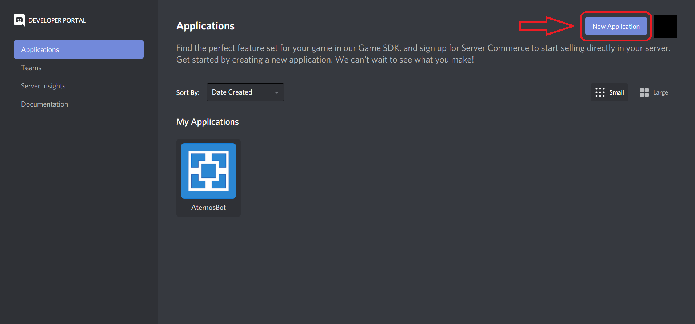
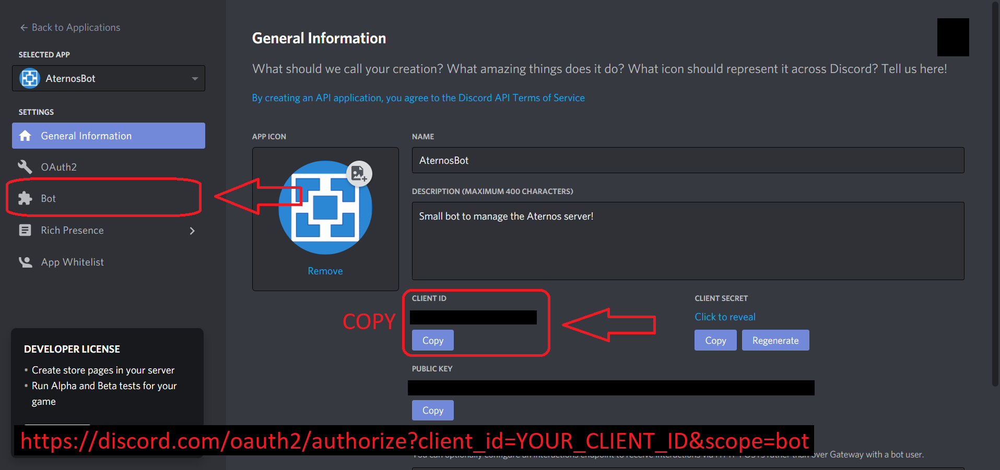
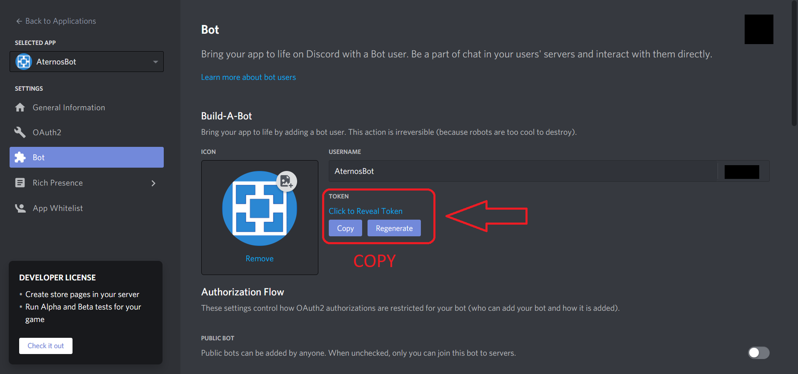
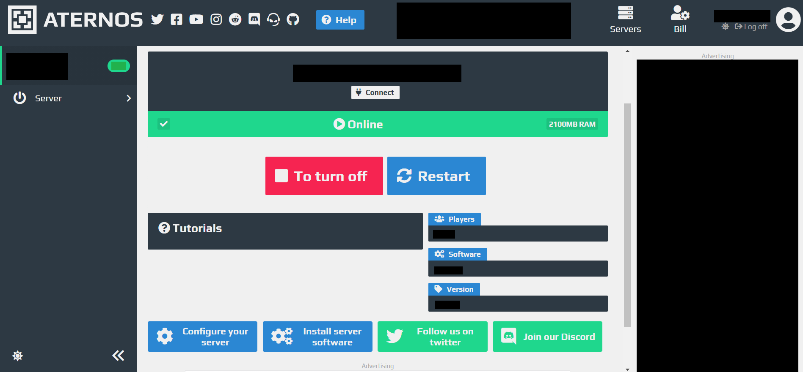
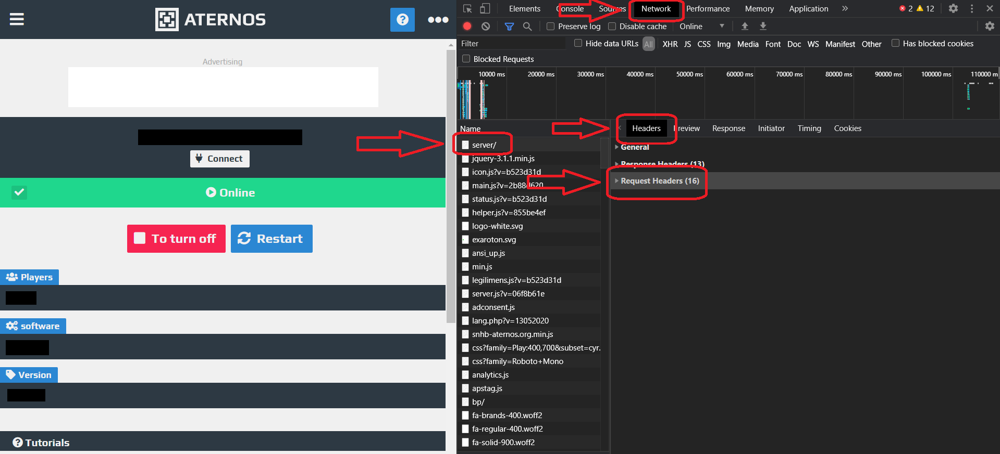
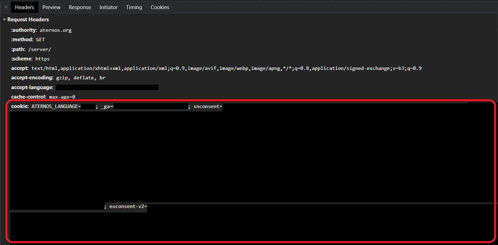

# Set up

You will have to host yourself this bot. To do this you can check the [Discord Developer Portal](https://discord.com/developers/docs/intro), [The Coding Train video](https://www.youtube.com/watch?v=ibtXXoMxaho&t) or try to follow these poorly-written instructions for the first part. Then you need to link the bot and Aternos, for that there is no external links avaliable (it is very specific), so you will have to follow this instruccions.

## Steps

+ Create a discord app and link it to a bot
+ Set up the bot
  - Downloading the source code and the required modules
  - Setting up the `data.json` file
    * Bot's `TOKEN`
    * Aternos `COOKIE`

## Create a discord app and link it to a bot

+ Go to [your Discord Developer Apps](https://discord.com/developers/applications) and create one. Fill the gaps with the required information.
+ Now go to your bots (on the side options) and create a bot linked to that application.
+ Finally, to be able to conect your application to your discord server, use the following link with the `CLIENT ID` of your application.
  ```
    https://discord.com/oauth2/authorize?client_id=YOUR_CLIENT_ID&scope=bot
  ```
This should make the bot join to your discord server, but it would appear as disconnected. Let's see how to turn it on.
**Note**: You can use the [official aternos icon](aternos-icon.png) for your bot.





## Set up the bot

+ Now, to set up the bot, just clone this repository with `git` from the `CMD`
  ```
    git clone https://github.com/MagnoElMagnifico/AternosBot
    ```
  or download the `.zip` file from [here](https://github.com/MagnoElMagnifico/AternosBot/archive/main.zip) and extract the source code.
+ [Python](https://www.python.org/downloads/) is required to run this program, so just type `python AternosBot.py` on the command line.
+ If you get some importing errors (`ModuleNotFoundError`), try installing those modules with:

  ```
    pip install discord.py
    pip install requests
    pip install bs4
  ```

## Set up the `data.json` file

+ To link this program with the actual discord's bot, create a `data.json` file on the root folder of this project (or change its path in [AternosBot.py](AternosBot.py) line 7) with the following structure:

  ```
    {
      "bot-token": "PASTE_HERE",
      "aternos-cookie": "PASTE_HERE"
    }
  ```

+ Go back to [your Discord Developer Apps](https://discord.com/developers/applications) and to the bot part. There, copy the `TOKEN` and replace the `bot-token` value on the `data.json` file.
+ To link to Aternos page you will need its cookie. Log in [your server page](https://www.aternos.com/server) and open the developer tools of your internet browser on the networking side.
+ Inside the header's lap you will see some requests that your computer is sending to the Aternos server. We focus on the `server/` one. It contains some data, but what we need is the `cookie` one.






## Congratulations

Congratulations! You sucessfully set up the bot and it is ready to go! If you have any problems, please [contact me](../README.md).
